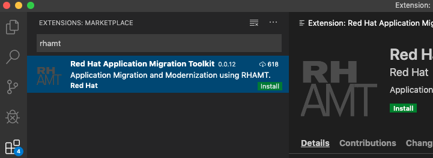
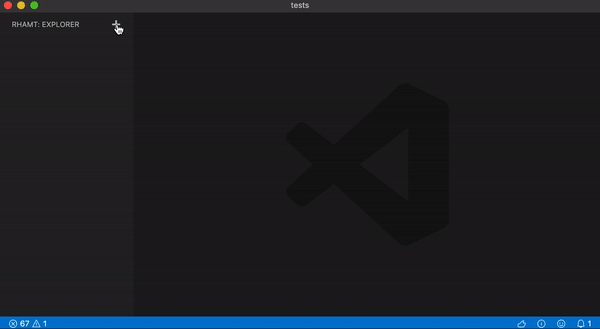
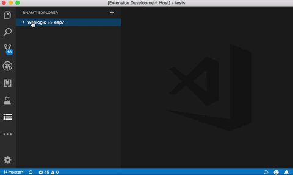
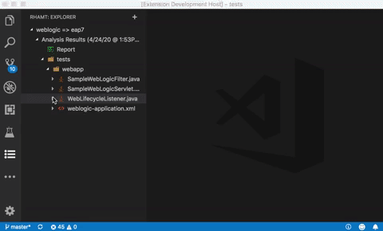
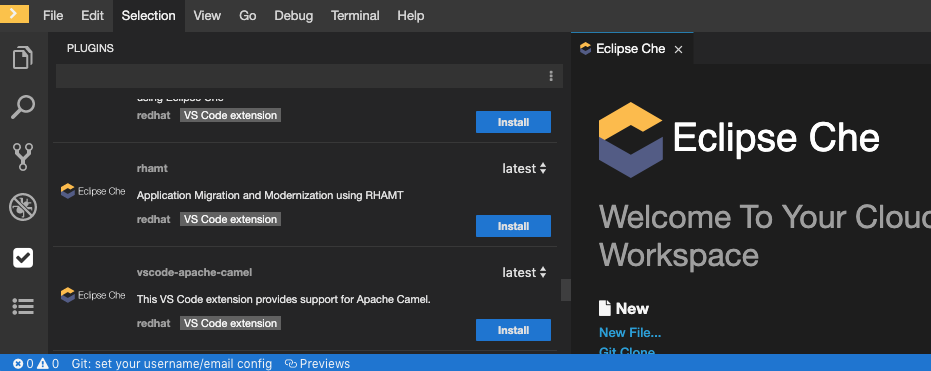

# Visual Studio Code RHAMT Extension

[](https://travis-ci.org/windup/rhamt-vscode-extension)
[](https://github.com/windup/rhamt-vscode-extension/blob/master/README.md)
[](https://marketplace.visualstudio.com/items?itemName=redhat.rhamt-vscode-extension)
[](https://marketplace.visualstudio.com/items?itemName=redhat.rhamt-vscode-extension)
[](https://marketplace.visualstudio.com/items?itemName=redhat.rhamt-vscode-extension)
## Description

The Visual Studio Code (VSCode) and Eclipse Che extension for the <b>Red Hat Application Migration Toolkit</b> (RHAMT).

RHAMT (the product of the downstream project [Windup](https://github.com/windup/windup)) is a command-line Application Migration and Modernization Assessment tool.

> The documentation for RHAMT can be found [here](https://developers.redhat.com/products/rhamt/overview).

## VSCode

This extension is published [here](https://marketplace.visualstudio.com/items?itemName=redhat.rhamt-vscode-extension) in the Microsoft Visual Studio Marketplace.

To add this extension to a VSCode installation, open VSCode, navigate to the Extensions Marketplace View, and search using the keyword `rhamt`.



## Features

This extension provides the ability to analyze, assess, and migrate source code (using RHAMT) from within VSCode and Eclipse Che.

The look and feel of both VSCode and Eclipse Che are very similar; therefore, the functionality demonstrated below should be consistent between the two environments.

#### Configuration Editor
Use the configuration editor to setup the analysis.  
  
  

#### Jump to Code
Jump to code containing identified migration issues.  
  
  

#### Issue Details
View details about the migration issue.  
  
  
  
#### Report
Use the generated reports to better understand and assess the migration efforts.  
  
  

## Eclipse Che

This extension is supported in [Eclipse Che](https://www.eclipse.org/che/) `7.4.0` or higher.

To add this plugin to a Che workspace, open Che, navigate to the plugins tab, and search using the keyword `migration`.


Alternatively, to add this plugin to a worksace, open Che, navigate to the Plugins view, and search for the `Application Migration Migration and Modernization using RHAMT` plugin.



## Requirements

* Java Platform, `JRE version 8+` with `JAVA_HOME` environment variable 
* A minimum of `4 GB RAM`; 8 GB recommended

> Tip: The rhamt-cli can be installed from within VSCode once the extension has been installed.

## Extension Settings

This extension contributes the following settings:

* `rhamt.executable.path`: The location of the rhamt-cli.

## Build

```bash
$ npm run compile
```
=======

## License
[MIT](LICENSE)
